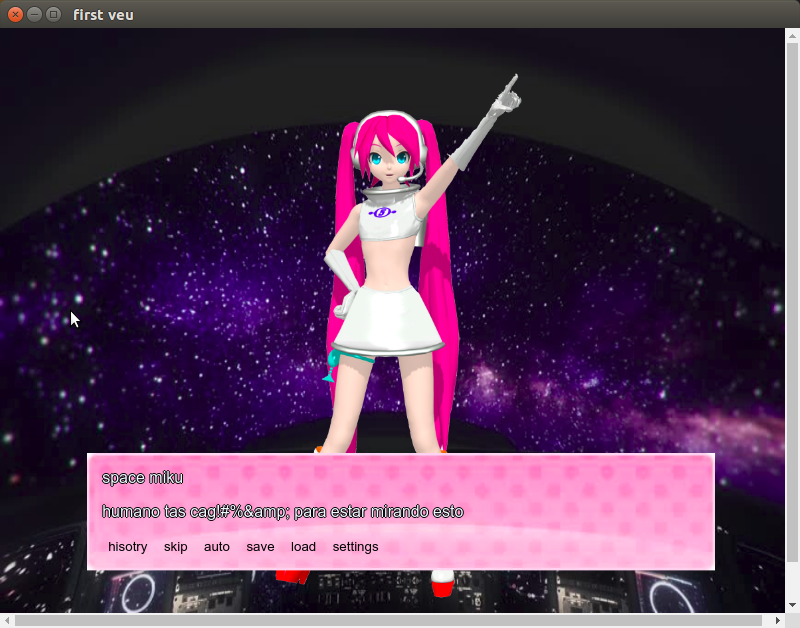

# pruebajs

# iniciar  
    npm init 
    npm install 
    npm test 

it's just a test, imitation of ren'py but with js node , vue and  ejs , to learn  

i'll like it could be export to diferents plataforms 
( to linux , windows  as desktop (electron) , to web and movile )    
# Now
 it can open a window and shows a menu and a simple scene

# next step 

* clean code 

* add char and dialg class with a simple sintax 

* show scene

* show char 

* sposition 

* music , video  and loop 

* jump 

* label 

* disolve y trnaciiocnes 

look more elements of orginal renpy 

;
